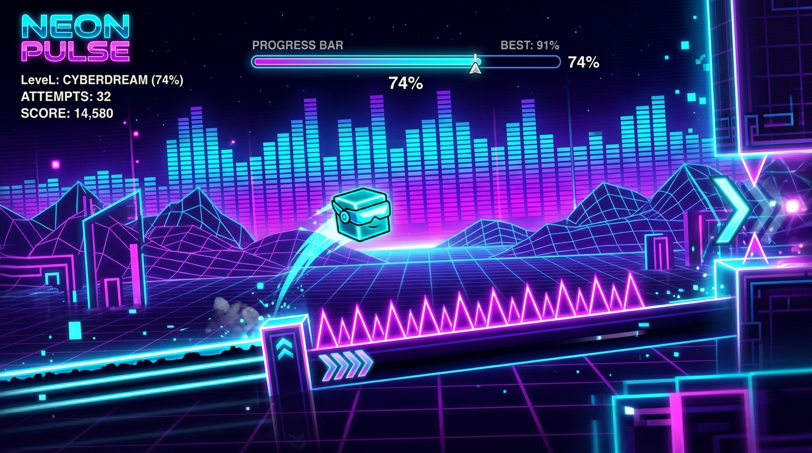

# NEON DASH - Rhythm Platformer 2D (Geometry Edition)

Game platformer 2D side-scrolling yang cepat, menantang, dan ritmis, terinspirasi oleh **Geometry Dash**. Pemain mengendalikan karakter kubus neon geometris yang berlari secara otomatis melintasi rintangan mematikan seperti duri, balok berpijak, platform gravitasi, bantalan lompat (*jump pads*), dan cincin udara (*jump orbs*) yang disinkronkan dengan dentuman soundtrack elektronik berenergi tinggi!



---

## 🎮 Fitur Utama Game

1. **Gameplay Ritmis & Menantang (Geometry Dash Style)**
   - Karakter berlari otomatis ke kanan (*auto-runner*).
   - Lompatan dipicu dengan ketukan layar (smartphone) atau tombol Spasi / Klik Mouse (komputer).
   - Animasi rotasi kubus di udara dengan snap mendarat mulus (*smooth landing physics*).
   - Kotak tabrakan (*hitbox*) yang presisi dan adil (*fair forgiving margins*).

2. **Beragam Level dengan Tema Visual & Tingkat Kesulitan**
   - **Level 1: Neon Pulse** (*Normal, 128 BPM*) - Tema Synthwave Cyan & Pink, ideal untuk pemula.
   - **Level 2: Electro Surge** (*Hard, 140 BPM*) - Tema Cyber Emerald, memperkenalkan *gravity flip* dan *jump orbs*.
   - **Level 3: Inferno Beat** (*Insane, 155 BPM*) - Tema Lava Vulkanik Merah Menyala, lompatan cepat dan *triple spike*.
   - **Level 4: Cosmic Abyss** (*Demon, 170 BPM*) - Tema Kosmik Nebula Ungu, ritme cepat dan presisi ekstrem.

3. **Kustomisasi Karakter Lengkap (Garage / Skin System)**
   - **8 Bentuk Ikon Karakter**: Neon Dash, Shadow Ninja, Cyber Bot, Alien Cyclops, Inferno Demon, Star Glider, Quantum Core, Retro Pixel.
   - **Palet Warna**: Pilihan Warna Utama, Warna Sekunder, dan Efek Cahaya Neon (*Neon Glow*).
   - **Efek Jejak (*Trail FX*)**: Sparks (Percikan Listrik), Fire (Api Menyala), Rainbow (Pelangi), Cyber Glitch (Distorsi Matriks), Ghost Echo (Bayangan Karakter).

4. **Level Editor Interaktif (Level Creator)**
   - Buat level kustom Anda sendiri langsung di dalam browser!
   - Palet objek lengkap: Balok, Balok Pendek, Duri (Bawah, Atas, Kiri, Kanan), Bantalan Lompat Kuning/Pink, Bola Lompat Kuning/Biru, Portal Gravitasi, dan Garis Akhir (*Finish Line*).
   - Fitur **Uji Coba (*Playtest*)** instan langsung dari editor.
   - Fitur **Ekspor & Impor Kode Level (JSON)** untuk berbagi tantangan dengan teman dan guru.

5. **Papan Peringkat Global & Statistik Pemain (*Leaderboard*)**
   - Mencatat persentase kemajuan (*% Progress*), jumlah percobaan (*Attempts*), dan waktu penyelesaian.
   - Tabel peringkat global dengan pemain kompetitif + pencatatan skor pengguna secara otomatis.
   - Tab filter per level (Level 1 hingga 4).

6. **Soundtrack Elektronik Prosedural & Efek Suara (Web Audio API)**
   - Musik elektronik multi-track dibuat secara langsung melalui sintesis audio browser tanpa file eksternal yang berat.
   - Sinkronisasi ketukan drum (*beat-sync*) yang menggerakkan denyut visual latar belakang dan garis lantai game.
   - Efek suara lengkap: lompatan, pantulan bantalan, cincin udara, pembalik gravitasi, ledakan kehancuran (*crash sound*), dan musik kemenangan (*victory fanfare*).

7. **Mode Latihan (*Practice Mode*)**
   - Pasang titik simpan (*Checkpoints*) hijau dengan tombol `+📍 Checkpoint` (atau tombol `Z` di keyboard).
   - Hapus titik simpan dengan tombol `-🗑 Hapus` (atau tombol `X` di keyboard).
   - Membantu pemain mempelajari bagian level yang sulit tanpa harus mengulang dari 0%.

---

## 📱 Panduan Pengujian

### 1. Buka Melalui Smartphone
- Jalankan web server lokal atau buka tautan publik GitHub Pages dari repository ini di browser smartphone Anda (Chrome, Safari, Firefox).
- Permainan dioptimalkan untuk orientasi horizontal (*Landscape*) maupun vertikal (*Portrait*).

### 2. Uji Responsivitas Tampilan
- **Kanvas Game**: Terpusat (*centered*) secara otomatis di tengah layar dengan rasio sinematik 16:9 yang proporsional.
- **Kontrol Sentuh**: Cukup ketuk di area layar mana saja untuk melompat atau berinteraksi dengan bola loncat.
- **Keterbacaan Teks**: Teks skor persentase (%), nomor percobaan (*attempt counter*), nama level, dan tombol navigasi dirancang besar dan jelas terbaca tanpa perlu memperbesar (*zoom*) layar.

### 3. Uji Siklus Permainan
1. Klik tombol **MULAI MAIN** pada Menu Utama.
2. Pilih **Level 1: Neon Pulse** dan klik **MAIN SEKARANG**.
3. Ketuk layar atau tekan Spasi untuk melompat menghindari duri.
4. Biarkan karakter menabrak duri untuk menguji kondisi **Game Over** (terjadi ledakan partikel dan layar *Game Over* muncul).
5. Klik tombol **ULANGI (RESTART)** atau ketuk layar kembali untuk memastikan logika permainan berjalan normal dan mengulang dengan cepat.
6. Selesaikan level hingga 100% untuk memicu perayaan kemenangan bintang dan kembang api!

### 4. Periksa Repository GitHub
- Repository: **https://github.com/yennivalencia/mygame**
- Buka tautan tersebut melalui **Mode Inkognito (Private Browsing)** di browser Anda.
- Pastikan status repository adalah **Public** agar seluruh kode sumber dapat diakses dan diperiksa oleh guru atau penilai tanpa login.

---

## ⌨️ Kontrol Permainan

| Perangkat | Aksi | Tombol / Gerakan |
|---|---|---|
| **Smartphone** | Melompat / Picu Orb | Ketuk di mana saja pada layar |
| **PC / Laptop** | Melompat / Picu Orb | `Spasi`, `Panah Atas`, `W`, atau Klik Mouse Kiri |
| **PC / Laptop** | Pasang Checkpoint (Latihan) | Tombol `Z` |
| **PC / Laptop** | Hapus Checkpoint (Latihan) | Tombol `X` |
| **Semua** | Jeda Permainan (*Pause*) | Tombol `⏸` di pojok kiri atas atau tombol `ESC` |

---

## 🛠️ Struktur Berkas Proyek

```text
mygame/
├── index.html          # Halaman utama game & seluruh antarmuka modal/HUD
├── README.md           # Dokumentasi lengkap proyek & petunjuk pengujian
├── css/
│   └── style.css       # Desain visual neon synthwave, animasi & tata letak responsif
└── js/
    ├── audio.js        # Engine Web Audio API: synthesizer musik elektronik & efek suara
    ├── physics.js      # Fisika tabrakan, lompatan, pantulan, rotasi kubus & gravitasi
    ├── particles.js    # Sistem partikel: jejak kubus, ledakan serpihan neon & kembang api
    ├── levels.js       # Data 4 level resmi dengan penempatan rintangan berbasis ritme
    ├── customizer.js   # Sistem kustomisasi 8 ikon karakter, palet warna, dan efek jejak
    ├── leaderboard.js  # Sistem papan peringkat lokal & global dengan persistensi LocalStorage
    ├── editor.js       # Level creator interaktif: penempatan grid, uji coba, ekspor/impor JSON
    ├── game.js         # Loop utama game (60 FPS), kamera bergerak, sinkronisasi ketukan audio
    └── main.js         # Orkestrator antarmuka pengguna, slider level, dan penyesuaian layar
```

---

## 🚀 Cara Menjalankan Secara Lokal

Game ini dibangun dengan teknologi web standar (**HTML5, Vanilla CSS, dan JavaScript murni**) tanpa dependensi eksternal yang rumit, sehingga dapat langsung dijalankan:

1. **Langsung Buka Berkas**:
   - Cukup klik ganda pada berkas `index.html` di komputer Anda untuk membukanya di browser modern apa pun.

2. **Menggunakan Local Server (Node.js)**:
   ```bash
   npx serve .
   ```
   atau menggunakan Python:
   ```bash
   python -m http.server 8000
   ```
   Buka `http://localhost:8000` di browser Anda.

---
*Dibuat dengan penuh dedikasi dan cinta untuk penggemar game ritmis arcade!*